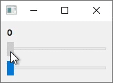

# nwidget

[中文](./doc/zh_cn/README.md)

> Note: This library is still under development.

`declarative syntax` and `property binding` extension for QWidget.

[Document](./doc/en/Document.md)

## Features

### Declarative Syntax


Imperative:
```cpp
auto* lineEdit = new QLineEdit;
lineEdit->setText("Hello");
auto* slider = new QSlider(Qt::Horizontal);
slider->setRange(0, 100);
slider->setValue(25);

auto* button0 = new QPushButton("Button 0");
auto* button1 = new QPushButton("Button 1");
auto* button2 = new QPushButton("Button 2");
button2->setSizePolicy(QSizePolicy::Preferred, QSizePolicy::Expanding);

auto* gridLayout = new QGridLayout;
gridLayout->addWidget(button0, 0, 0);
gridLayout->addWidget(button1, 1, 0);
gridLayout->addWidget(button2, 0, 1, 2, 1);

auto* formLayout = new QFormLayout;
formLayout->addRow("Line 0", lineEdit);
formLayout->addRow("Line 1", slider);
formLayout->addRow(gridLayout);
```

Declarative:
```cpp
QLayout* layout = nw::FormLayout{
    {"Label 0", nw::LineEdit().text("Hello")},
    {"Label 1", nw::Slider(Qt::Horizontal).range(0, 100).value(25)},
    {GridLayout{
        {0, 0,       nw::PushButton("Button 0")},
        {1, 0,       nw::PushButton("Button 1")},
        {0, 1, 2, 1, nw::PushButton("Button 2").sizePolicy(QSizePolicy::Preferred, QSizePolicy::Expanding)
        },
    }}};
```

### Property Binding



```cpp
nw::LabelRef  label   = new QLabel;
nw::SliderRef slider1 = new QSlider;
nw::SliderRef slider2 = new QSlider;

QLayout* layout = nw::VBoxLayout{
    nw::Label(label),
    nw::Slider(slider1, Qt::Horizontal),
    nw::Slider(slider2, Qt::Horizontal),
};

label.text() = nw::asprintf("%d", slider1.value() + slider2.value());
```

## Advantages

- Intuitive
- Easy to modify
- Easy to maintain
- Fun

## Examples

[NWidget Gallery](./examples/gallery) : [Widget Gallery](https://doc.qt.io/qt-6/qtwidgets-gallery-example.html) written with nwidget.


[Binding Example](./examples/binding_example)


[Length Calculator](./examples/length_calculator)


## Special Thanks

- [@QuadnucYard](https://github.com/QuadnucYard) for clarifying doubts about C++.
- [@Niwik](https://github.com/niwik-dev) for suggestions on the property binding.