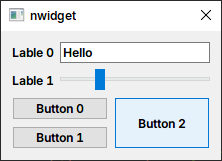

# nwidget

[中文](./doc/zh_cn/README.md)

> Note: This library is not yet complete.

Create QWidget program UI in declarative syntax.

From imperative:
```cpp
auto* lineEdit = new QLineEdit;
lineEdit->setText("Hello");
auto* slider = new QSlider(Qt::Horizontal);
slider->setRange(0, 100);
slider->setValue(25);

auto* button0 = new QPushButton("Button 0");
auto* button1 = new QPushButton("Button 1");
auto* button2 = new QPushButton("Button 2");
button2->setSizePolicy(QSizePolicy::Preferred, QSizePolicy::Expanding);

auto* gridLayout = new QGridLayout;
gridLayout->addWidget(button0, 0, 0);
gridLayout->addWidget(button1, 1, 0);
gridLayout->addWidget(button2, 0, 1, 2, 1);

auto* formLayout = new QFormLayout;
formLayout->addRow("Line 0", lineEdit);
formLayout->addRow("Line 1", slider);
formLayout->addRow(gridLayout);
```

To declarative:
```cpp
QLayout* layout = nw::FormLayout{
    {"Lable 0", nw::LineEdit().text("Hello")},
    {"Lable 1", nw::Slider(Qt::Horizontal).range(0, 100).value(25)},
    {GridLayout{
        {0, 0,       nw::PushButton("Button 0")},
        {1, 0,       nw::PushButton("Button 1")},
        {0, 1, 2, 1, nw::PushButton("Button 2").sizePolicy(QSizePolicy::Preferred, QSizePolicy::Expanding)
        },
    }}};
```

Result:



At the same time, you can still use imperative syntax:

```cpp
auto* button = new QPushButton;
button->setText("Button");

QSlider* slider0 = nullptr;
QSlider* slider1 = nullptr;

QLayout* layout = nw::VBoxLayout{
    button,
    nw::Slider().bindTo(slider0),
    nw::Slider().bindTo(slider1),
};

connect(slider0, &QSlider::valueChanged, slider1, &QSlider::setValue);
```

## Advantage

- Intuitive
- Easy to modify
- Easy to maintain
- Funny

## Example

- [NWidget Gallery](./examples/gallery) : [Widget Gallery](https://doc.qt.io/qt-6/qtwidgets-gallery-example.html) written using nwidget.
