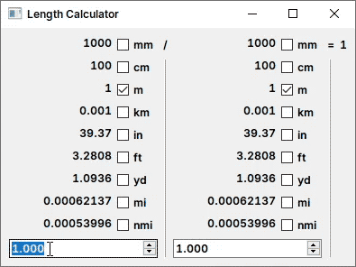

# nwidget

[中文](./doc/zh_cn/README.md)

`declarative syntax` and `property binding` extension for QWidget.

[Document](./doc/en/Document.md)

## Features

### Declarative Syntax


Imperative:
```cpp
auto* lineEdit = new QLineEdit;
lineEdit->setText("Hello");
auto* slider = new QSlider(Qt::Horizontal);
slider->setRange(0, 100);
slider->setValue(25);

auto* button0 = new QPushButton("Button 0");
auto* button1 = new QPushButton("Button 1");
auto* button2 = new QPushButton("Button 2");
button2->setSizePolicy(QSizePolicy::Preferred, QSizePolicy::Expanding);

auto* gridLayout = new QGridLayout;
gridLayout->addWidget(button0, 0, 0);
gridLayout->addWidget(button1, 1, 0);
gridLayout->addWidget(button2, 0, 1, 2, 1);

auto* formLayout = new QFormLayout;
formLayout->addRow("Line 0", lineEdit);
formLayout->addRow("Line 1", slider);
formLayout->addRow(gridLayout);
```

Declarative:
```cpp
namespace nw = nwidget;

QLayout* layout = nw::FormLayout{
    {"Label 0", nw::LineEdit().text("Hello")},
    {"Label 1", nw::Slider(Qt::Horizontal).range(0, 100).value(25)},
    {GridLayout{
        {0, 0,       nw::PushButton("Button 0")},
        {1, 0,       nw::PushButton("Button 1")},
        {0, 1, 2, 1, nw::PushButton("Button 2").sizePolicy(QSizePolicy::Preferred, QSizePolicy::Expanding)
        },
    }}};
```

### Property Binding


```cpp
namespace nw = nwidget;

nw::LabelId  label   = new QLabel;
nw::SliderId slider1 = new QSlider;
nw::SliderId slider2 = new QSlider;

QLayout* layout = nw::VBoxLayout{
    nw::Label(label)
        .text(nw::asprintf("%d", slider1.value() + slider2.value())),
    nw::Slider(slider1).orientation(Qt::Horizontal),
    nw::Slider(slider2).orientation(Qt::Horizontal),
};

// It also equivalent to the following 3 ways:
label.text() = nw::asprintf("%d", slider1.value() + slider2.value());

nw::asprintf("%d", slider1.value() + slider2.value())
    .bindTo(label, &QLabel::setText);

nw::asprintf("%d", slider1.value() + slider2.value())
    .bindTo(label, [label](const QString& s) {label.text() = s;});

```

## Advantages

- Intuitive
- Easy to modify
- Easy to maintain
- Fun

## Installing

```shell
mkdir build
cd build
cmake .. -DCMAKE_INSTALL_PREFIX:PATH=/installation/path
cmake --build . --config Release --target install
```

```cmake
find_package(nwidget CONFIG REQUIRED)
target_link_libraries(main PRIVATE nwidget::nwidget)
```

## Examples

[NWidget Gallery](./examples/gallery) : [Widget Gallery](https://doc.qt.io/qt-6/qtwidgets-gallery-example.html) written with nwidget.


[Binding Example](./examples/binding_example)


[Length Calculator](./examples/length_calculator)



## Special Thanks

- [@QuadnucYard](https://github.com/QuadnucYard) for guidance on C++.
- [@Niwik](https://github.com/niwik-dev) for suggestions on the property binding.