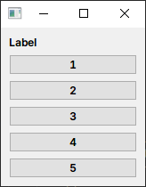

# Documentation

- [Layout Syntax](#layout-syntax)
  - [Overview](#overview)
  - [ForEach](#foreach)
- [Property Binding](#property-binding)
  - [Overview](#overview-1)
  - [xxxRef](#xxxref)
  - [Property](#property)
  - [Member Functions](#member-functions)
  - [Special C++ Features](#special-c-features)

## Layout Syntax

### Overview

Use declarative syntax to arrange controls and set their properties through chain calls.

```cpp
auto* button1 = new QPushButton;
auto* button2 = new QPushButton;
button1.setText("Button");

QLayout* layout = nw::VBoxLayout{
    button1,                                // Use existing object
    new QPushButton,
    nw::PushButton(),
    nw::PushButton(button2).text("Button"), // Build on existing object
};
```

### ForEach

```cpp
std::vector<int> nums = {1, 2, 3, 4, 5};

QLayout* layout = nw::VBoxLayout{
    nw::Label("Label"),
    nw::ForEach(nums, [](int index, int value) -> nw::BoxLayoutItem {
        return new QPushButton(QString::number(value));
    })
};
```



## Property Binding

### Overview

nwidget uses syntax similar to [qml property binding](https://doc.qt.io/qt-6/qtqml-syntax-propertybinding.html).

```cpp
nw::SliderRef slider1;
nw::SliderRef slider2;
nw::SliderRef slider3;

QLayout* layout = nw::VBoxLayout{
    nw::Slider(slider1, Qt::Horizontal),
    nw::Slider(slider2, Qt::Horizontal),
    nw::Slider(slider3, Qt::Horizontal),
};

slider3.value() = slider1.value() + slider2.value();
```

You can use the same property of the same instance in expressions but should avoid loops and updating expression values within the expression.

```cpp
button.iconSize()
= nw::constructor<QSize>(slider.value(), button.iconSize().invoke(&QSize::height));
//                       ^               ^ changed signal were ignored
//                       changed signal were connedt
```

### xxxRef

`xxxRef` is a helper class with the following feature:
1. Uniquely identifies an object, similar to [id](https://doc.qt.io/qt-6/qtqml-syntax-objectattributes.html#the-id-attribute) in qml, so it cannot be set to a new value.
2. Returns an instance of the `Property` object representing a QObject property.

> The name `xxxRef` does not clearly indicate its functionality. I hope to find a better name in the future.

> To create a corresponding Ref object for your class, refer to [length_calculator](../../examples/length_calculator):

### Property

`Property` represents a property of a QObject, recording the property's name, Getter, Setter, and changed signal.

```cpp
nw::LabelRef label = new QLabel;

QString name = decltype(label.text())::Info::name(); // "text"

label.text() = "hello";
QString text = label.text();
```

> The `Binding` object automatically connects to the `destroyed` signal of the QObject corresponding to the Property object in the binding expression.

### Member Functions

Use `invoke` to represent member function calls:

```cpp
nw::LineEditRef edit1;
nw::LineEditRef edit2;
nw::LabelRef label;

// ...

label.text() = (edit1.text() + ' ' + edit2.text()).invoke(&QString::toLower);
```

The `invoke` method can carry parameters:

```cpp
label.text() = lineEdit.text().invoke(&QString::last, 5);
```

### Special C++ Features

Some C++ features cannot be directly used in binding expressions, so nwidget provides the following methods:

|                            | Function         | Note                 |
| -------------------------- | ---------------- | -------------------- |
| `nw::call`                 | Function call    | Can carry parameters |
| `nw::constructor<T>`       | Constructor call | Can carry parameters |
| `nw::cast`                 | Type casting     |                      |
| `nw::static_cast_<T>`      | static_cast      |                      |
| `nw::reinterpret_cast_<T>` | reinterpret_cast |                      |

And a helper method `nw::asprintf`