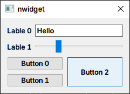
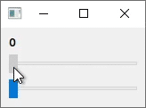
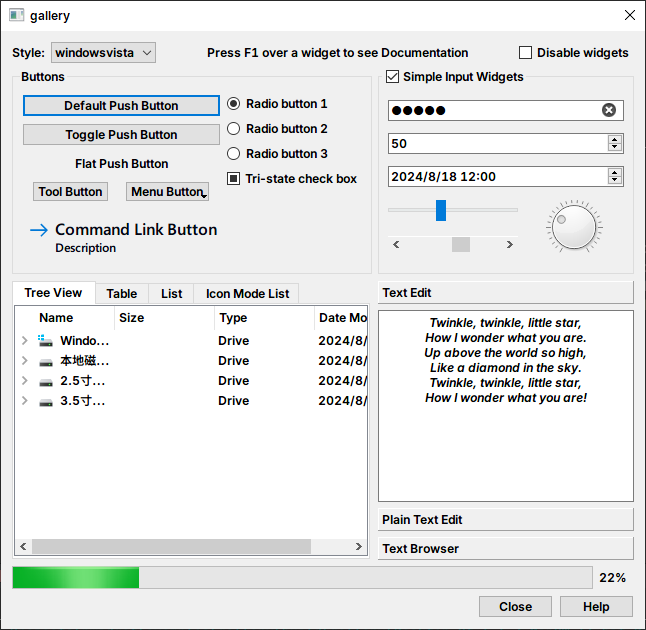
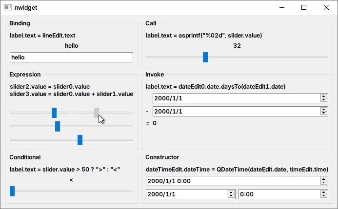
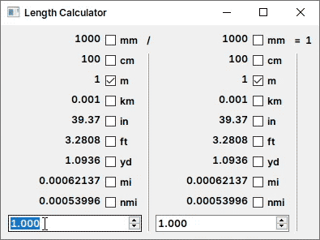

# nwidget

> 注意：该库当前仍在开发中

QWidget 的 `声明式语法` 和 `属性绑定` 拓展

[文档](Document.md)

## 功能

### 声明式语法



命令式：
```cpp
auto* lineEdit = new QLineEdit;
lineEdit->setText("Hello");
auto* slider = new QSlider(Qt::Horizontal);
slider->setRange(0, 100);
slider->setValue(25);

auto* button0 = new QPushButton("Button 0");
auto* button1 = new QPushButton("Button 1");
auto* button2 = new QPushButton("Button 2");
button2->setSizePolicy(QSizePolicy::Preferred, QSizePolicy::Expanding);

auto* gridLayout = new QGridLayout;
gridLayout->addWidget(button0, 0, 0);
gridLayout->addWidget(button1, 1, 0);
gridLayout->addWidget(button2, 0, 1, 2, 1);

auto* formLayout = new QFormLayout;
formLayout->addRow("Line 0", lineEdit);
formLayout->addRow("Line 1", slider);
formLayout->addRow(gridLayout);
```

声明式：
```cpp
QLayout* layout = nw::FormLayout{
    {"Lable 0", nw::LineEdit().text("Hello")},
    {"Lable 1", nw::Slider(Qt::Horizontal).range(0, 100).value(25)},
    {GridLayout{
        {0, 0,       nw::PushButton("Button 0")},
        {1, 0,       nw::PushButton("Button 1")},
        {0, 1, 2, 1, nw::PushButton("Button 2").sizePolicy(QSizePolicy::Preferred, QSizePolicy::Expanding)
        },
    }}};
```

### 属性绑定



```cpp
nw::LabelId  label   = new QLabel;
nw::SliderId slider1 = new QSlider;
nw::SliderId slider2 = new QSlider;

QLayout* layout = nw::VBoxLayout{
    nw::Label(label)
        .text(nw::asprintf("%d", slider1.value() + slider2.value())),
    nw::Slider(slider1, Qt::Horizontal),
    nw::Slider(slider2, Qt::Horizontal),
};
```

## 优点

- 直观
- 易于修改
- 易于维护
- 有趣

## 示例

[NWidget Gallery](../../examples/gallery)：用 nwidget 编写的 [Widget Gallery](https://doc.qt.io/qt-6/qtwidgets-gallery-example.html)



[Binding Example](../../examples/binding_example)：属性绑定示例



[Length Calculator](../../examples/length_caculator)：长度单位计算器



## 特别感谢

- [@QuadnucYard](https://github.com/QuadnucYard) 对 C++ 的解疑
- [@Niwik](https://github.com/niwik-dev) 对属性绑定机制的建议
